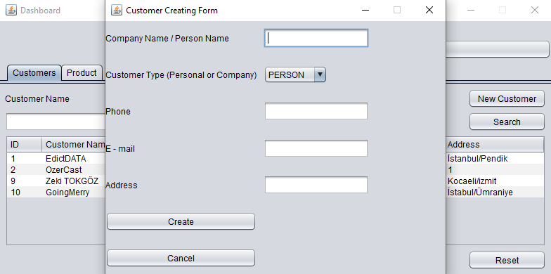

# Commentary
This project made for education of swing framework ui design. The software include database and software ui. On the other hand i express my gratitude to patika.dev crew. *"Backend Web Development Path with Beginner Java"* named education bootcamp is ended with this project. 

## About me

 

## Database structure image

## UI structure image

